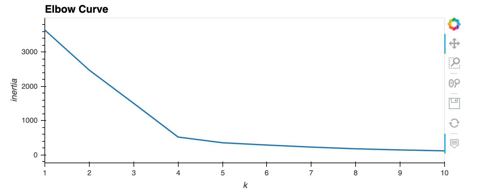
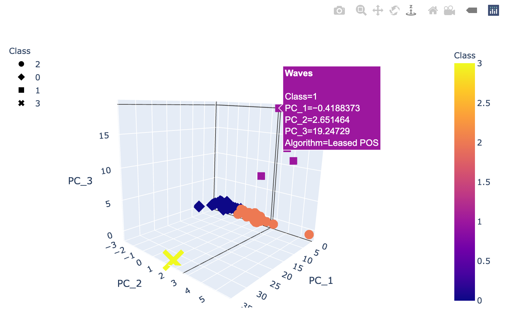
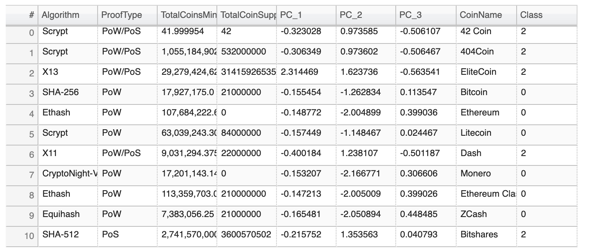
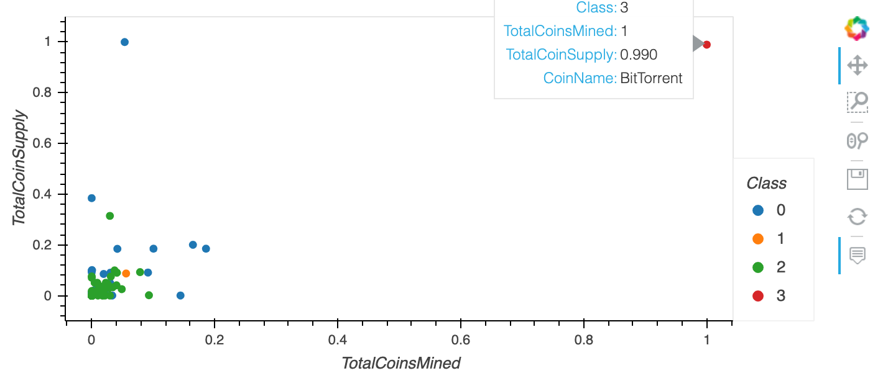

# Cryptocurrencies

## Overview
This project was undertaken to analyze a dataset of cryptocurrencies to help an investment bank with classification of different tradable cryptocurrencies for a new investment product they are evaluating. Like most datasets the cryptocurrency data needs some processing and transformation before we can apply unsupervised machine learning algorithms to find potentially interesting groupings of the many cryptocurrencies traded. After cleaning, filtering and scaling the dataset we reduce the number of dimensions we will look at to a manageable amount using a PCA algorithm. Then we cluster the data using K Means algorithm. Finally we create visualizations of the results of the our analysis, showing potentially interesting groupings of cryptocurrencies for a classification system for a crypto based investment product.

### Resources
* Python 3.7
* Jupyter Notebook
* VS Code 
* Machine Leaning library modules:
    * scikit learn preprocessing
    * scikit learn decomposition 
    * scikit learn cluster 

* Main functions/algorithms:
    * StandardScaler 
    * MinMaxScaler
    * PCA
    * K Means

## Summary

We plot an Elbow Curve to determine an optimal number of dimensions (in this case, 4) to run an unsupervised machine learning model. 
 

This 3D Scatterplot shows the groupings of the 4 clusters and PCA classes:
 

The tradable cryotocurrency data and PCA component values are displayed in tabular form:
 

The grouping of Total Coins Mined and Total Coin Supply by Class are shown on this scatterplot:
 

